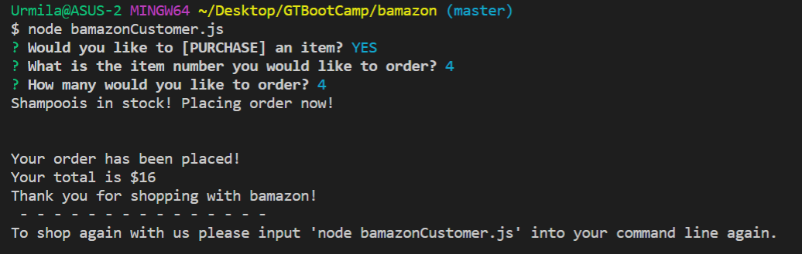
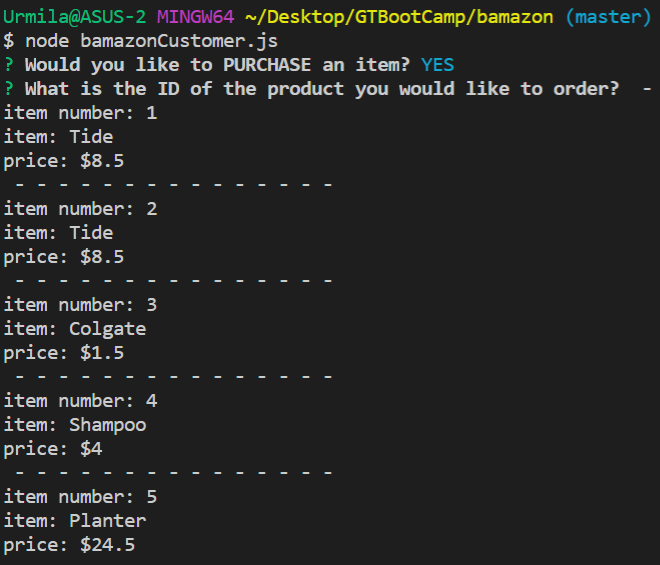
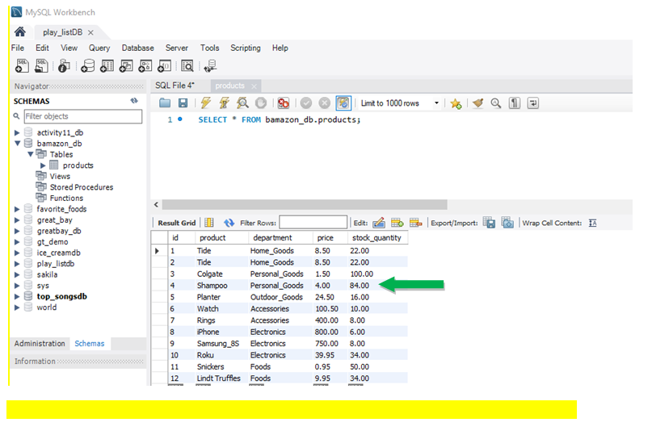

# bamazon
NodeJS application simulating "Amazon" concepts
# Node.js & MySQL

## Overview

In this activity, I have be created an Amazon-like storefront with the MySQL skills learned this unit. The app will take in orders from customers and deplete stock from the store's inventory. Please see the screen shots below that are from nodejs and mysql updates to the database.

